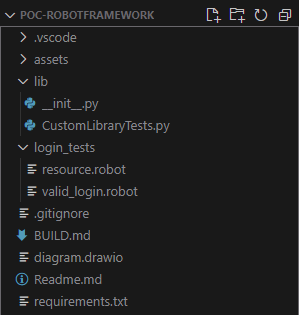
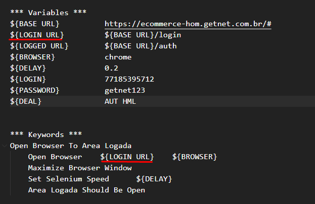
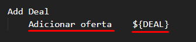
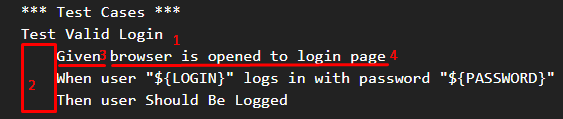
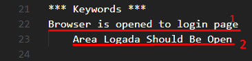
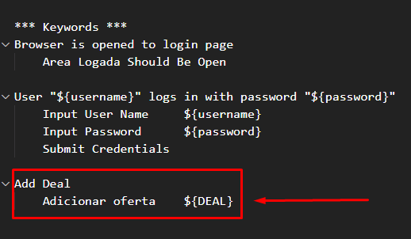
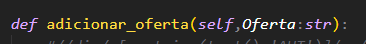
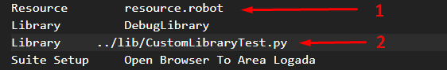

# POC - Robotframework
O Presente projeto visa demonstrar para as partes interessadas as funcionalidades básicas do framework Robotframework. 
Neste documento, será explicado conceitos fundamentais para se trabalhar com a ferramenta utilizando sua própria sintaxe e também em Python.


## Estrutura do Projeto

Para iniciarmos, tenha em mente a estrutura do projeto:



1. **assets**: Pasta destinada ao armazenamento de arquivos gerais do projeto, como imagens do readme;
2. **lib**: Módulo que contém todas as *Custom Libraries* do projeto;
3. **login_tests**: É a pasta que armazenará nossa *Test Suite*;
    - **resource.robot**: Este arquivo contém algumas **Keywords** **Variables** que são utilizadas nos *Test Cases* das *Test Suites*;
    - **valid_login.robot**: É a nossa Suite de Teste. O que a diferencia do arquivo *resource.robot* é que ela possui a escrita dos *Test Cases*.
4. **requirements.txt**: Um dos arquivos de extrema importância do projeto. Nele, colocamos todas as dependências utilizadas ao longo do projeto para que possamos instalá-las em uma única linha de comando, sendo esta: `pip install -r <caminho-para-requirements.txt>`.


## Entendendo a sintaxe do Robotframework
Embora o Framework interprete arquivos .txt, é importante mantermos a convenção em que os arquivos que trabalhem com o framework sejam nomeados com a extensão **.robot**, conforme na imagem do tópico acima mostra os arquivos `resource.robot`e `valid_login.robot`. 


### Identação
A identação nas escritas de scripts com o Robotframework é de extrema importância. Quando precisamos passar algum parâmetro para variáveis, funções ou configurações em *settings*, precisamos dar no **mínimo** **dois** espaços. No projeto, foi utilizado **Um Tab** (ou quatro espaços) para melhorar a legibilidade.


### Variáveis
Atribuímos ou utilizamos variáveis, utilizamos a seguinte notação: `${<nome-da-variável>}`. Observe:




### Funções
As funções no Framework são chamadas no escopo *Keywords*, podendo ser de bibliotecas próprias como a *SeleniumLibrary* quanto bibliotecas criadas para o projeto chamadas de *CustomLibraries*. Para utilizar a função de alguma biblioteca, é necessário que os scripts dentro da biblioteca estejam escritos em **snake case**, e ao escrevê-las no arquivo *.robot*, temos que **trocar** o separador "_" por um **espaço**. Observe:



No caso da imagem acima, o nosso script python possui uma função chamada `adicionar_oferta(Oferta)`.


## Escopos
Nos arquivos de texto .robot, fazemos a divisão dos escopos envolvendo suas palavras-chave por asterísco: \*\*\*<nome-escopo>\*\*\*. Os escopos utilizados no projeto são *Settings*, *Test Cases* e *Keywords*.


### Settings
Neste escopo, colocamos configurações de **imports**, configurações da **Suite** e dos **Testes**. Importante saber que estas duas últimas configurações fazem sentido nos arquivos que possuem **Casos de Teste**, uma vez que as mesmas referem-se diretamente ao ciclo de vida dos mesmos. Abaixo, traremos as explicações sobre estar configurações tomando como exemplo o nosso arquivo `valid_login.robot`.

#### Suite Setup e Suite Teardown
Estas duas configurações podem equivaler aos hooks *before* e *afterAll*. Aqui, colocamos as configurações que acontecerão **antes** e **depois** da execução de todos os testes. De um ponto de vista mais técnico, devemos usar estas configurações para algumas ações cruciais como a inicialização da instância do Driver e suas configurações para a execução da nossa **Suite**, bem como a finalização da instância do mesmo (dado que estamos utilizando um ambiente Selenium para testes de inteface gráfica).

No projeto, utilizamos a função `Open Browser to Area Logada` do nosso arquivo *resource.robot* em **Suite Setup** para Abrir o Browser e realizar algumas configurações como a velocidade que o driver trabalha e o tamanho da janela do Browser. Além desta função, utilizamos a função **nativa** `Close Browser` em **Suite Teardown** para fecharmos o nosso Browser e finalizarmos o nosso teste.

#### Test Setup e Test Teardown
Podemos dizer que atuam como beforeEach e afterEach. Colocamos as configurações que serão executadas no ínico e fim de **cada** teste. No contexto do projeto, cada vez que um teste iniciar, nossa tela de login é acionada para que façamos o fluxo do teste do 0.


### Variables
No escopo *Variables* colocamos todas as variáveis que serão utilizadas no arquivo. É recomendável que, caso haja variáveis que se repetem pelas suites de teste, que estas sejam declaradas no arquivo `resource.robot` da pasta das suites. Observa abaixo um exemplo deste escopo:


### Test Cases
Neste bloco, colocamos todos os casos de teste que nossa Suite irá executar. No projeto, foi optado pela sintaxe de **BDD** para a escrita dos Testes. Observe a imagem abaixo:



Legenda:
1 - Nome do Teste;
2 - Identação de 4 espaços ou um tab do nível do *Nome do Teste*
3 - Na escrita de BDD, a primeira palavra do teste **sempre** será alguma palavra reservada da sintaxe do BDD;
4 - A *Keyword* para buscar o step a ser executado.

Importante salientar que, ao colocarmos um escopo *Test Cases* em um arquivo .robot, deixamos claro que este arquivo será uma suite de testes, pois o gatilho de execução do teste são as funções neste escopo.


### Keywords
Nossos "steps" ficam no bloco *Keywords*. Aqui, nós escrevemos todas as ações que deverão ser executadas quando o nosso caso de teste o executar:



1 - Nome da Keyword
2 - Ação a ser executada pela Keyword. Neste caso, ela vem do arquivo `resource.robot` importado no bloco **Settings**.

**Obs**.: Repare que a identação, apesar de não ter sido destacada, também se manteve aqui.


## Arquivos do Projeto


### Test Suite
No framework, um **Test Suite** é um arquivo que contém um ou mais casos de testes, podendo armazenar variáveis próprias e  **Keywords**. Além disto, podemos colocar as <u>configurações</u> de *Suite* e *Testes*. 

Observe o código abaixo do arquivo `valid_login.robot`
```
    *** Settings ***
    Library         DebugLibrary
    Resource        resource.robot
    Suite Setup     Open Browser To Area Logada
    Suite Teardown  Close Browser
    Test Setup      Go To Login Page

    *** Test Cases ***
    Test Valid Login
        Given browser is opened to login page
        When user "${LOGIN}" logs in with password "${PASSWORD}"
        Then user Should Be Logged 

    Add Purchase Order
        Given browser is opened to login page
        When user "${LOGIN}" logs in with password "${PASSWORD}"
        And user Should Be Logged
        Then Add Deal


    *** Keywords ***
    Browser is opened to login page
        Area Logada Should Be Open

    User "${username}" logs in with password "${password}"
        Input User Name     ${username}
        Input Password      ${password}
        Submit Credentials

    Add Deal
        Adicionar oferta    ${DEAL}

```
#### Settings
No escopo *Settings** deste arquivo, colocamos o import de uma biblioteca para realizar Debug, a importação do arquivo *resource* da suite, configurações de *Suite Setup*, *Suite Teardown* e *Test Setup* em que respectivamente abre o Browser (e instancia o Driver) ao iniciarmos a Suite, fecha o Browser ao terminá-la e, no inicio de cada teste, o Driver vai para a página de login.

#### Test Cases
Criamos nossos testes de casos com as *Keywords* declaradas abaixo e utilizamos a sintaxe **BDD** para organizarmos nossos steps.

#### Keywords
Por fim, aqui chamamos as funções colocamos no arquivo `resource.robot` em **suas próprias** *Keywords*, além das funções escritas no arquivo `CustomLibraryTests.py`.


### Arquivo resource.robot
A criação de um arquivo "resouce.robot" nos traz a possibilidade da criação de uma camada mais "próxima do driver". Isto significa que podemos criar *Keywords* nela que executam as ações dos usuários como **clicks**, **input de dados** e outras interações. Observe o código abaixo:

```
*** settings ***
Library     SeleniumLibrary
Library     ../lib/CustomLibraryTest.py

*** Variables ***
${BASE URL}          https://ecommerce-hom.getnet.com.br/#
${LOGIN URL}         ${BASE URL}/login 
${LOGGED URL}        ${BASE URL}/auth   
${BROWSER}      chrome
${DELAY}        0.2
${LOGIN}        77185395712
${PASSWORD}     getnet123
${DEAL}         AUT HML


*** Keywords ***
Open Browser To Area Logada
    Open Browser    ${LOGIN URL}    ${BROWSER}
    Maximize Browser Window
    Set Selenium Speed      ${DELAY}
    Area Logada Should Be Open

Area Logada Should Be Open
    Title Should Be     Credenciamento Digital Getnet

Go to Login page    
    Go To       ${LOGIN URL}

Input User Name
    [Arguments]     ${username}
    Input Text      input-login-username    ${username}

Input Password
    [Arguments]     ${password}
    Input Text      input-login-password    ${password}

Submit Credentials
    Click Element   //span[contains(text(),'entrar')]/..

User Should Be Logged
    Wait Until Element Is Not Visible       //p[contains(text(),'Autenticando')]
    Location Should Be  ${LOGGED URL}
```

#### Settings
Na parte de Settings, temos dois imports: *SeleniumLibrary* e o import da nossa *CustomLibrary*. Repare que a nossa *Custom* se encontra depois do import do *Selenium*. Mais tarde, será explicado o motivo.

#### Variables
Neste escopo estamos definindo as variáveis que serão utilizadas no nosso teste, tendo variáveis armazenando **endereços** e dados importantes como sobre o usuário e o Driver.

#### Keywords
Note que este é o último escopo do códgio e **não temos** um escopo "***** Test Cases **** aqui. Isto por que o arquivo **não deve ser uma suite de teste**, e sim um arquivo com *Keywords auxiliares*. Ou seja: Não deve ser possível rodar diretamente este arquivo.

Importante lembrar que as Keywords deste arquivo devem ter de fato as **ações** do Driver como via de regra, como observado no código.


## Funções nativas do Selenium
Ao importar a SeleniumLibrary, temos acessos a algumas funções que o selenium nos traz. Na Keyword *Open Browser To Area Logada* utilizamos a função `Open Browser` do Selenium que está recebendo a url de Login e o Browser que será utilizado para o nosso teste. Temos também a função `Go To` utilizada na Keyword *Go to Login page*, que está recebendo um endereço da web, entre outras funções.


## CustomLibrary
Em alguns casos em que o Framework não consegue nos fornecer ajuda, acabamos por precisar de escrever scripts em alguma linguagem - no nosso caso, Python. Sendo assim, uma *CustomLibrary* nada mais é que um **arquivo** criado no projeto para satisfazer as necessidades que o Framework nativamente não possui. Desta forma, podemos criar nossos próprios Scripts, **Atuando** a camada do arquivo `resource.robot`. Logo, podemos colocar suas funções diretamente nas *Keywords* da **Suite**:


Para conseguirmos ter acesso às funções da CustomLibrary, precisamos garantir o seguinte padrão:

No arquivo, as funções deverão estar em **snake case**, e nas Keywords, deverão ser chamadas como uma frase normal de acordo com as palavras, onde a **primeira** palavra deverá ter letra **maiúscula** e a quantidade de espaços será de acordo com a quantidade dos separadores "_" utilizados na função:




Dadas estas recomendações, observe a CustomLibrary do nosso projeto chamada de `CustomLibraryTest.py`:

```
from robot.libraries.BuiltIn import BuiltIn
from selenium.webdriver.common.by import By

SL = BuiltIn().get_library_instance("SeleniumLibrary")

class CustomLibraryTest(object):
    def __init__(self):
        pass

    def adicionar_oferta(self,Oferta:str):
        try:
            oferta = SL.find_element(By.XPATH, "//div/a[contains(text(),'"+Oferta+"')]/../..//../div/button/span[contains(text(),'eu quero')]")        
            oferta.click()
        except(ValueError):
            print(ValueError)
```


### Importância do Import da CustomLibrary Após o do Selenium
Ao escrevermos nosssos Scripts de uma forma tradicional, estaremos criando uma nova instância de um *Selenium Webdriver* que, por consequência, abrirá outra janela do Browser, causando confusão entre os steps e impedindo que o relatório final do Framework fique completo.

Para evitarmos o problema descrito acima, devemos **sempre** trabalhar com a mesma instância do Driver. Para isso, precisamos garantir que o Driver do **Robot** seja instanciado primeiro e nosso script rode depois. Para isso acontecer, precisamos pegar a instância do Driver do Framework dentro da nossa *CustomLibrary*. Seguindo esta explicação, precisamos que o **import** da *SeleniumLibrary* venha **antes** da nossa *CustomLibrary* para que seja possível capturar a instância do Driver com a função `BuiltIn().get_library_instance("SeleniumLibrary")`. 

Caso utilizarmos a função citada acima mas colocarmos o import da nossa *CustomLibrary* **antes** da *SeleniumLibrary*, o nosso script não achará a biblioteca do Framework e gerará o seguinte erro: `No library 'SeleniumLibrary' found`, além de, no relatório, aparecer que não foi possível achar as funções da nossa *CustomLibrary*.

#### Recomendações quanto ao import da CustomLibrary
**Import da CustomLibrary no arquivo resource.robot**: Utilize esta forma de import se **todas** as suites forem utilizar uma determinada CustomLibrar.

**Import da CustomLibrary nas Suites de Teste**: Utilize esta forma de import **se** houver CustomLibraries **específicas** para cada *Suite*. Desta forma, devemos colocar o *import* do resource **antes** da adição das *CustomLibraries* conforme a imagem abaixo:




## Relatório
Após rodar o projeto (ver arquivo *BUILD.md*), são gerados, na pasta root, três arquivos: *log.html*, *output.xml* e  *report.html*.
O arquivo *log.html* oferece uma visão em cascata de todos os dados dados.


